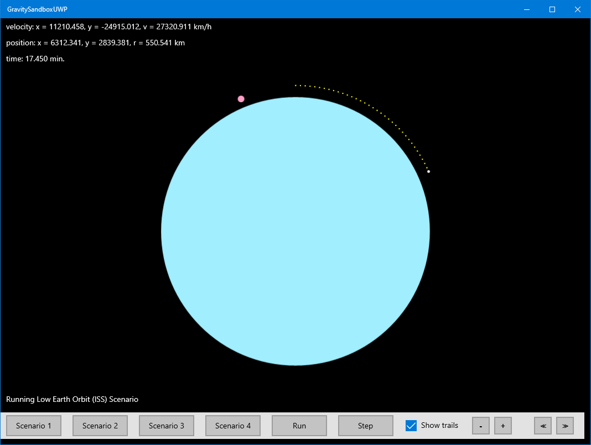

## Gravity-Sandbox
Very old XAML/UWP app. Porting to various platforms to test and learn.

# Potential ports
- [x] Latest UWP
- [ ] WPF on .NET Core 3
- [ ] Win2D on UWP
- [ ] Unity (change to spheres in 3D)
- [ ] (Low priority) Xamarin on Android Phone or iPad

# General TBDs
- [x] Get the simulation running again
- [ ] Figure out the animation problem that started ~2016
- [ ] Perf of gravity calculations, XAML modifications
- [ ] Run gravity calculations on multiple threads?
- [ ] New scenarios: Orbits, stars and planets, black holes and stars
